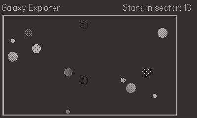

# Procedurally Generated Galaxy

## Background 

Heavily inspired by [Procedural Generation: Programming The Universe](https://www.youtube.com/watch?v=ZZY9YE7rZJw&ab_channel=javidx9)

This game is for [Panic's Playdate](https://play.date/). 

From the [Playdate Wikipedia](https://en.wikipedia.org/wiki/Playdate_(console)):

    Playdate is a handheld video game console developed by Panic. As well as buttons and a directional pad, the device has a mechanical crank on its side. The device is small, square, and yellow, featuring a black-and-white 1-bit screen for display, with a 4 way directional pad, two game buttons, and a mechanical crank on the side.

## Demo

The "Galaxy Explorer" is a procedurally generated star map. Navigation is through the D-pad, the crank cycles through stars in the visible sector. Selecting a star with the A button brings up a "solar view", with some additional information, such as the name of the star (generated using a Markov Chain), the position, the radius of the star, and the planets in that solar system.

## Running in Simulator

To run this, you need to download and install the [Playdate simulator](https://play.date/dev/).

Then, extract extract the `.pdx` from the archive.

`tar -xf galaxy/galaxy.tar.gz`

Finally, launch the Playdate Simulator, go to File -> Open -> Navigate to `galaxy.pdx` -> Open